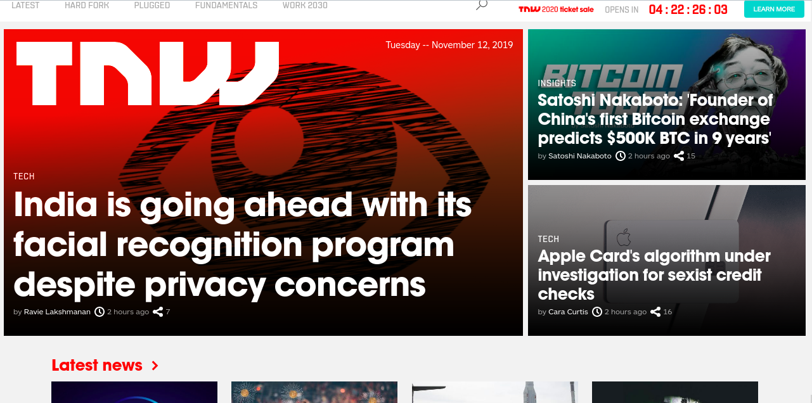

# The Next Website Clone

This project consists of replicating the [The Next Web](https://thenextweb.com/) website emphasizing on how it behaves differently depending on the size of the screen where the website is rendered.

## Screenshots

## Project Description

<https://www.theodinproject.com/courses/html5-and-css3/lessons/building-with-responsive-design>

## Run locally

1. Clone the project- git clone <https://github.com/bafiam/Next-Web-clone.git>
2. Cd Next-Web-clone
3. Run index.html on your browser

## Built With

1. HTML5
2. CSS3

## Github Pages Link

<https://bafiam.github.io/Next-Web-clone/>

## License

This project is licensed under the MIT License - see the [LICENSE.md](LICENSE.md) file for details.

## Authors

1. [Iyara Oghenefegor Ferguson](https://github.com/fegzycole)
2. [Stephen Gumba](https://github.com/bafiam)

## Acknowledgments

* Microverse.
